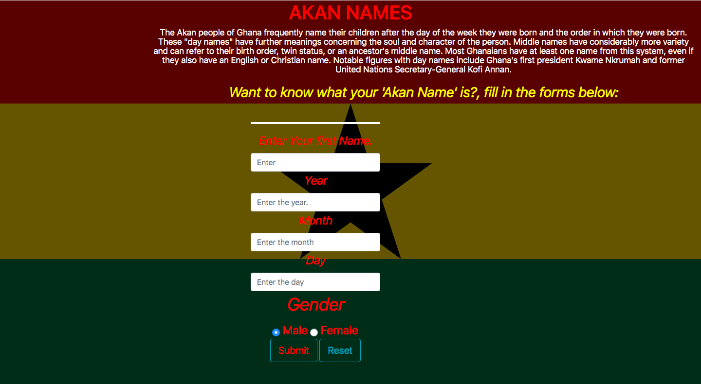
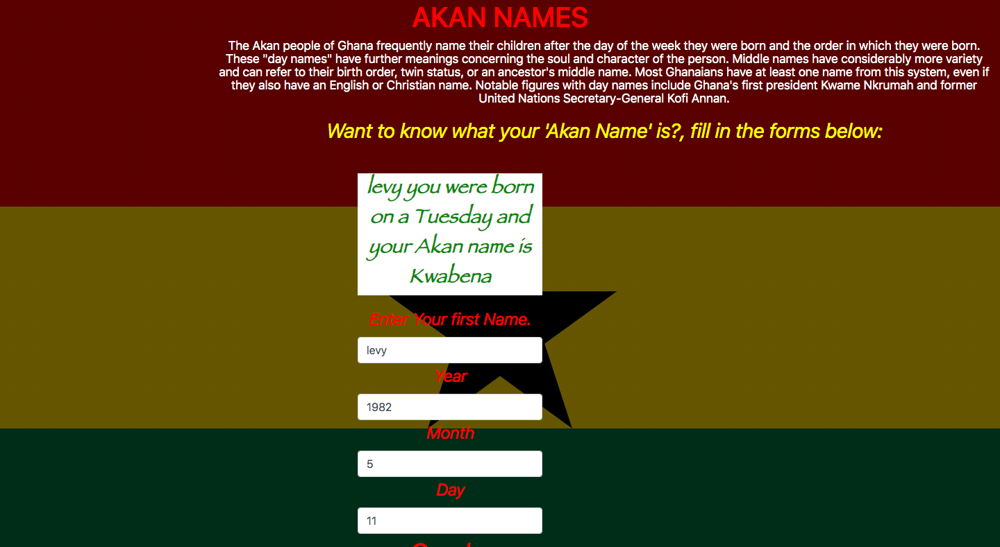

## Table of Contents

- Project Title
- Description
- Deployment
- BDD (Behaviour Driven Development)
- Project Screenshot
- Technologies used
- Acknowledgement
- Licence
- Contacts
- Author

# AKAN NAMING SYSTEM

## DESCRIPTION

- This is a website that was inspired by the Ghananian way of determining `new-borns's first name`. Just by adding your `birthday date` , the site calculates the `day of the week` you were born and then depending on their gender outputs their Akan Name.

## Deployment

- You can vist the site directly by clicking 
- To view the source codes on github click 

## BDD

> The website will require a user to fill out information about his date of birth and the century he was was born.
> The application calculates the day of the week the user was born and outputs it.
> One will be required to choose his gender and then click on the submit button in order to generate his/her Akan name.
> The application matches the day of the week with a specific Akan Name and outputs it to the user with a personalized message.

- NB : `All input should be in Numbers`

## Project Screenshot

- This is the landing page of the website.

- This is the section where one gets to fill out the form.

## Technologies Used
- html
 - css
 - javascript
 - bootsrap 
 
 ## Acknowledgement 
 I would like to thank the following for their assistance through out this project.
  - Collegues for their assistance in the project
  - The TM's for provding assitance in the project

## Licence

The MIT License (MIT)

Copyright (c) 2019 Levy Kariuki.

Permission is hereby granted, free of charge, to any person obtaining a copy of this software and associated documentation files (the "Software"), to deal in the Software without restriction, including without limitation the rights to use, copy, modify, merge, publish, distribute, sublicense, and/or sell copies of the Software, and to permit persons to whom the Software is furnished to do so, subject to the following conditions:

The above copyright notice and this permission notice shall be included in all copies or substantial portions of the Software.

THE SOFTWARE IS PROVIDED "AS IS", WITHOUT WARRANTY OF ANY KIND, EXPRESS OR IMPLIED, INCLUDING BUT NOT LIMITED TO THE WARRANTIES OF MERCHANTABILITY, FITNESS FOR A PARTICULAR PURPOSE AND NONINFRINGEMENT. IN NO EVENT SHALL THE AUTHORS OR COPYRIGHT HOLDERS BE LIABLE FOR ANY CLAIM, DAMAGES OR OTHER LIABILITY, WHETHER IN AN ACTION OF CONTRACT, TORT OR OTHERWISE, ARISING FROM, OUT OF OR IN CONNECTION WITH THE SOFTWARE OR THE USE OR OTHER DEALINGS IN THE SOFTWARE.

@LevyKariuki

## Contacts

- Incase of any feedback you can reach me through my personal contacts:
  - levthigkari@gmail.com
  - 0712342318

## Author

> **Levy Kariuki**
